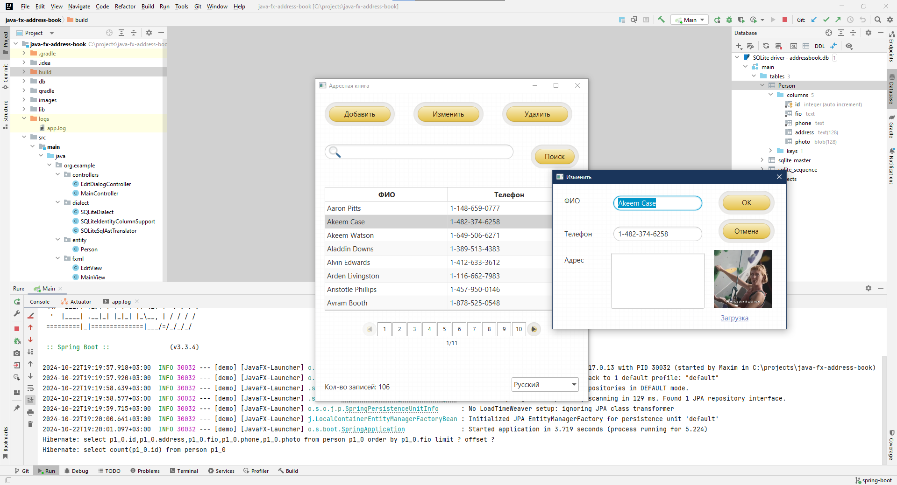

# JavaFX Address Book + Spring Boot
Адресная книга на **JavaFX** и базе данных **SQLite**. Слой доступа к БД реализован через **JPA**. Используется полная версия **Liberica JDK 17**, т.к. она содержит *jfxrt.jar*.

Scenic View is a JavaFX application designed to make it simple to understand the current state of your application scenegraph, and to also easily manipulate properties of the scenegraph without having to keep editing your code.

  
Скриншоты

 